# Summary of 2_DecisionTree

[<< Go back](../README.md)

## Decision Tree
- **n_jobs**: -1
- **criterion**: gini
- **max_depth**: 3
- **explain_level**: 2

## Validation
 - **validation_type**: split
 - **train_ratio**: 0.75
 - **shuffle**: True
 - **stratify**: True

## Optimized metric
logloss

## Training time

16.3 seconds

## Metric details
|           |    score |   threshold |
|:----------|---------:|------------:|
| logloss   | 0.431098 | nan         |
| auc       | 0.872229 | nan         |
| f1        | 0.833564 |   0.504445  |
| accuracy  | 0.809362 |   0.504445  |
| precision | 0.960432 |   0.829987  |
| recall    | 1        |   0.0679791 |
| mcc       | 0.613485 |   0.504445  |

## Metric details with threshold from accuracy metric
|           |    score |   threshold |
|:----------|---------:|------------:|
| logloss   | 0.431098 |  nan        |
| auc       | 0.872229 |  nan        |
| f1        | 0.833564 |    0.504445 |
| accuracy  | 0.809362 |    0.504445 |
| precision | 0.803884 |    0.504445 |
| recall    | 0.865519 |    0.504445 |
| mcc       | 0.613485 |    0.504445 |

## Confusion matrix (at threshold=0.504445)
|                  |   Predicted as long |   Predicted as short |
|:-----------------|--------------------:|---------------------:|
| Labeled as long  |                1468 |                  515 |
| Labeled as short |                 328 |                 2111 |

## Learning curves
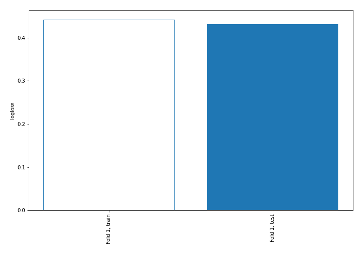

## Decision Tree 

### Tree #1
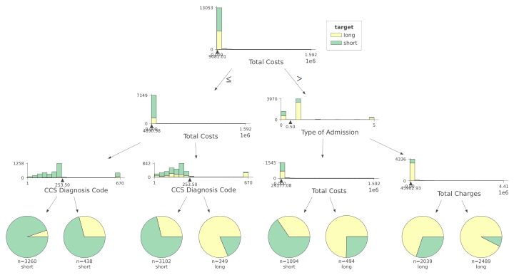

### Rules

if (Total Costs <= 9081.005) and (Total Costs <= 4890.975) and (CCS Diagnosis Code <= 253.5) then class: short (proba: 94.79%) | based on 3,260 samples

if (Total Costs <= 9081.005) and (Total Costs > 4890.975) and (CCS Diagnosis Code <= 253.5) then class: short (proba: 71.21%) | based on 3,102 samples

if (Total Costs > 9081.005) and (Type of Admission > 0.5) and (Total Charges > 45902.932) then class: long (proba: 92.45%) | based on 2,489 samples

if (Total Costs > 9081.005) and (Type of Admission > 0.5) and (Total Charges <= 45902.932) then class: long (proba: 69.89%) | based on 2,039 samples

if (Total Costs > 9081.005) and (Type of Admission <= 0.5) and (Total Costs <= 24177.08) then class: short (proba: 65.45%) | based on 1,094 samples

if (Total Costs > 9081.005) and (Type of Admission <= 0.5) and (Total Costs > 24177.08) then class: long (proba: 74.7%) | based on 494 samples

if (Total Costs <= 9081.005) and (Total Costs <= 4890.975) and (CCS Diagnosis Code > 253.5) then class: short (proba: 70.78%) | based on 438 samples

if (Total Costs <= 9081.005) and (Total Costs > 4890.975) and (CCS Diagnosis Code > 253.5) then class: long (proba: 81.38%) | based on 349 samples

## Permutation-based Importance
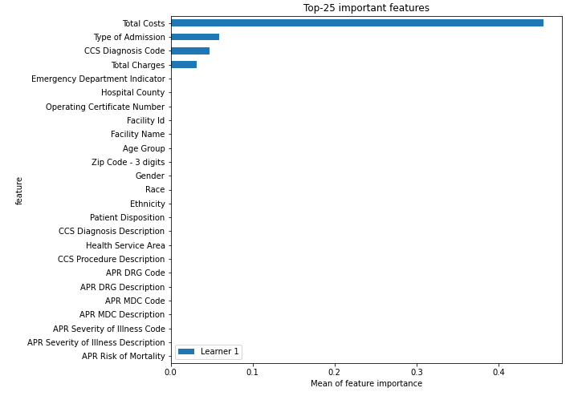
## Confusion Matrix

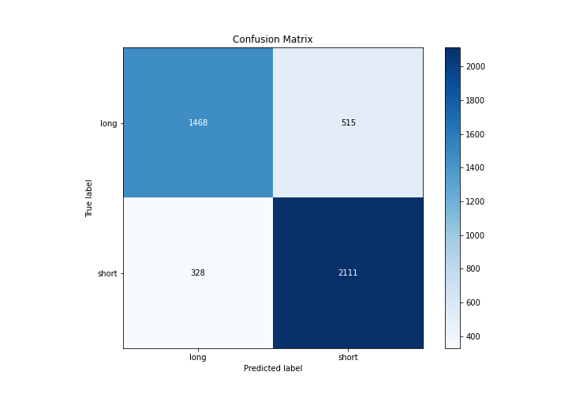

## Normalized Confusion Matrix

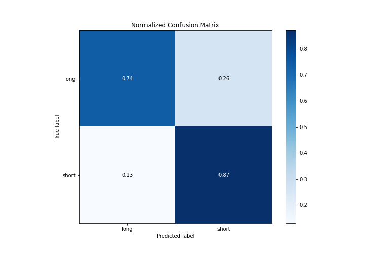

## ROC Curve

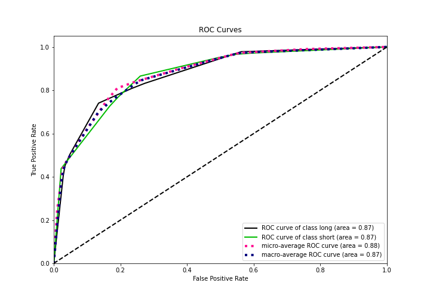

## Kolmogorov-Smirnov Statistic

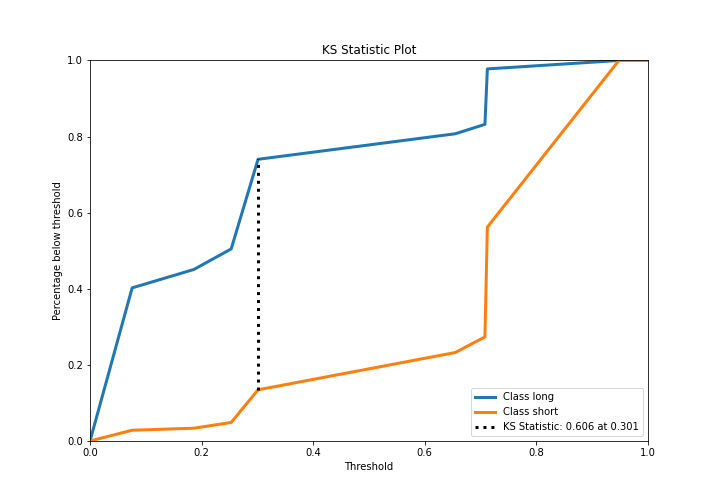

## Precision-Recall Curve

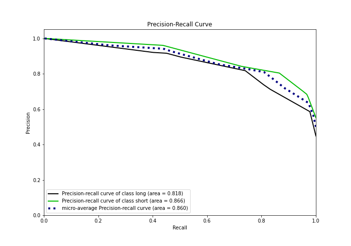

## Calibration Curve

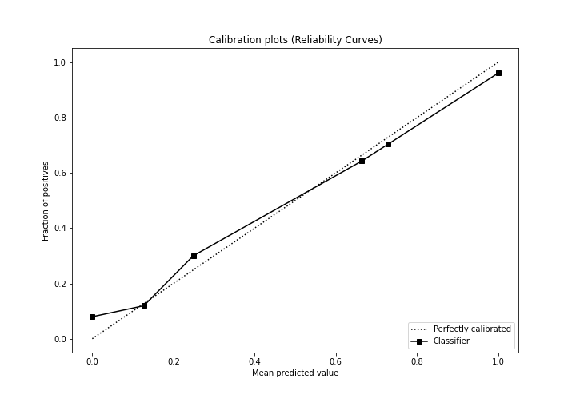

## Cumulative Gains Curve

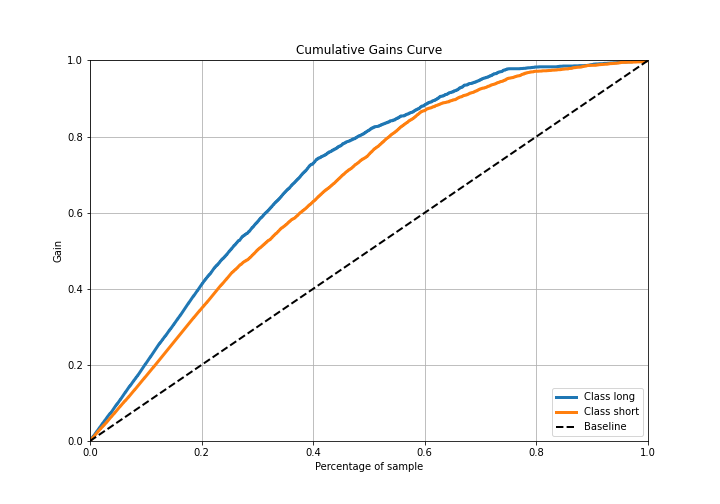

## Lift Curve

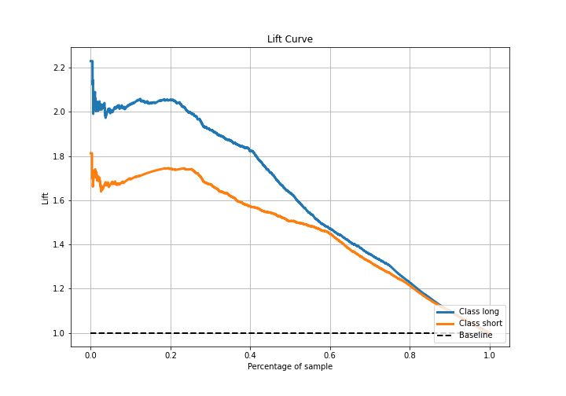

## SHAP Importance
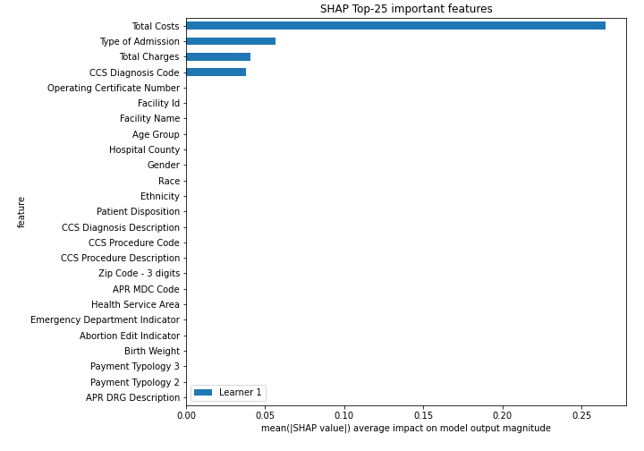

## SHAP Dependence plots

### Dependence (Fold 1)
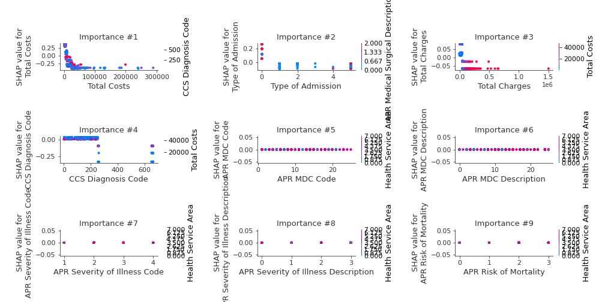

## SHAP Decision plots

### Top-10 Worst decisions for class 0 (Fold 1)
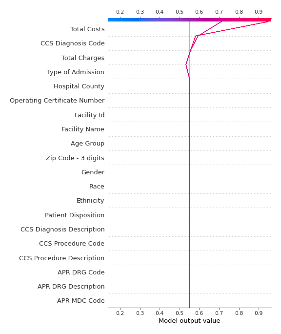
### Top-10 Best decisions for class 0 (Fold 1)
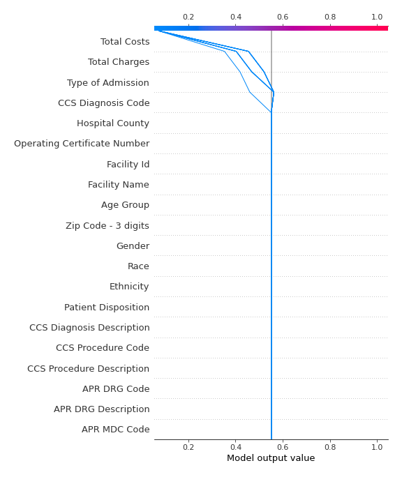
### Top-10 Worst decisions for class 1 (Fold 1)
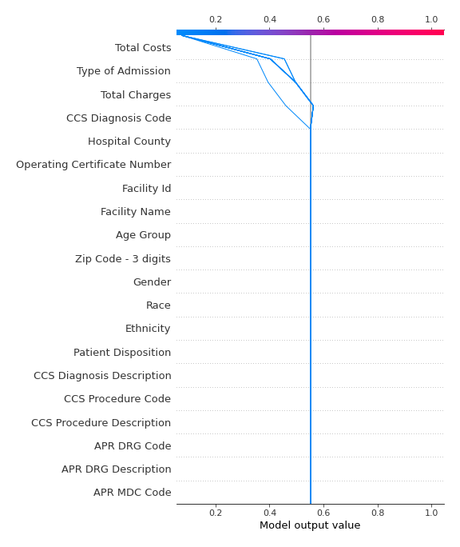
### Top-10 Best decisions for class 1 (Fold 1)
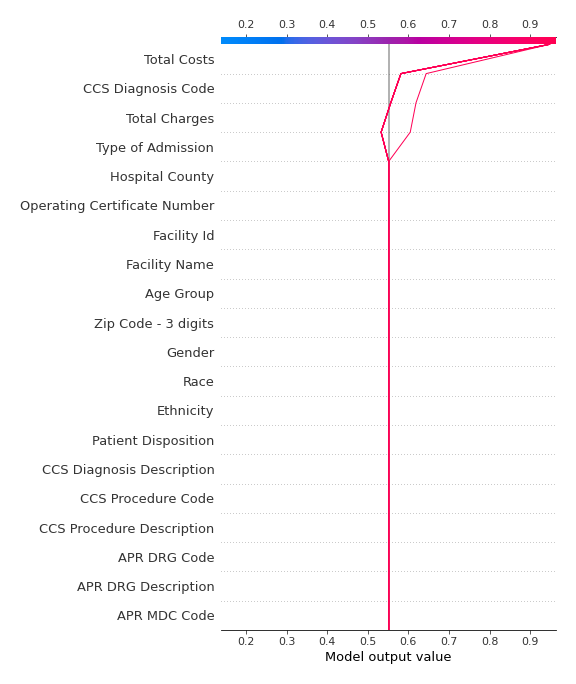

[<< Go back](../README.md)
