# Summary of 3_Default_Xgboost

[<< Go back](../README.md)

## Extreme Gradient Boosting (Xgboost)
- **n_jobs**: -1
- **objective**: binary:logistic
- **eta**: 0.075
- **max_depth**: 6
- **min_child_weight**: 1
- **subsample**: 1.0
- **colsample_bytree**: 1.0
- **eval_metric**: logloss
- **explain_level**: 2

## Validation
 - **validation_type**: split
 - **train_ratio**: 0.75
 - **shuffle**: True
 - **stratify**: True

## Optimized metric
logloss

## Training time

32.3 seconds

## Metric details
|           |    score |     threshold |
|:----------|---------:|--------------:|
| logloss   | 0.244482 | nan           |
| auc       | 0.963344 | nan           |
| f1        | 0.912928 |   0.520228    |
| accuracy  | 0.90389  |   0.520228    |
| precision | 1        |   0.999119    |
| recall    | 1        |   5.80332e-05 |
| mcc       | 0.805687 |   0.520228    |

## Metric details with threshold from accuracy metric
|           |    score |   threshold |
|:----------|---------:|------------:|
| logloss   | 0.244482 |  nan        |
| auc       | 0.963344 |  nan        |
| f1        | 0.912928 |    0.520228 |
| accuracy  | 0.90389  |    0.520228 |
| precision | 0.912367 |    0.520228 |
| recall    | 0.913489 |    0.520228 |
| mcc       | 0.805687 |    0.520228 |

## Confusion matrix (at threshold=0.520228)
|                  |   Predicted as long |   Predicted as short |
|:-----------------|--------------------:|---------------------:|
| Labeled as long  |                1769 |                  214 |
| Labeled as short |                 211 |                 2228 |

## Learning curves
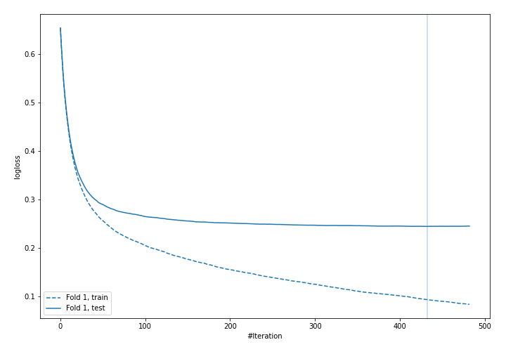

## Permutation-based Importance
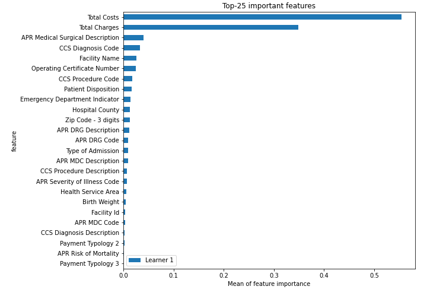
## Confusion Matrix

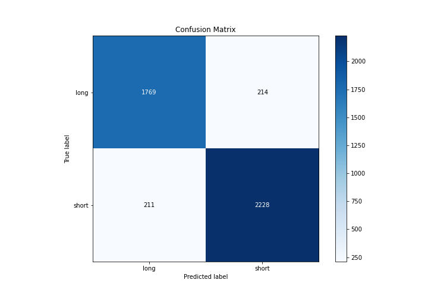

## Normalized Confusion Matrix

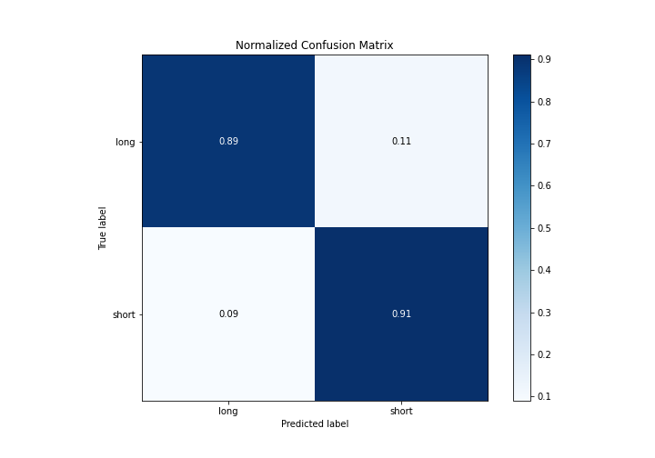

## ROC Curve

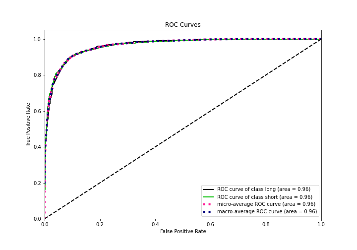

## Kolmogorov-Smirnov Statistic

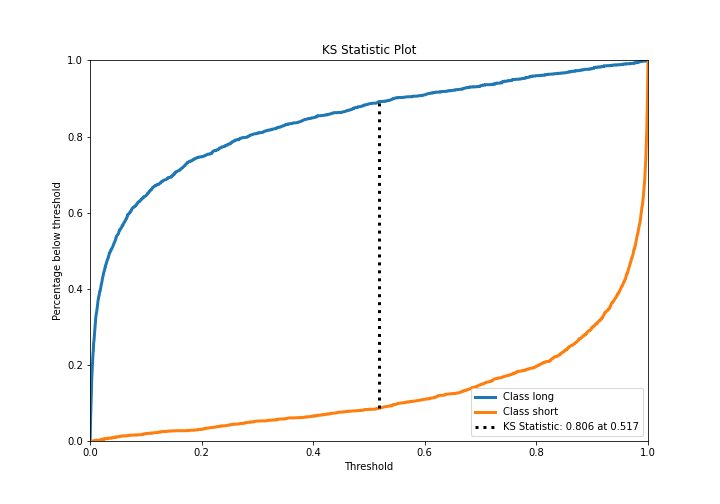

## Precision-Recall Curve

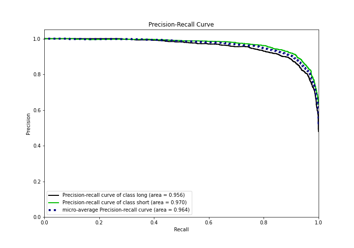

## Calibration Curve

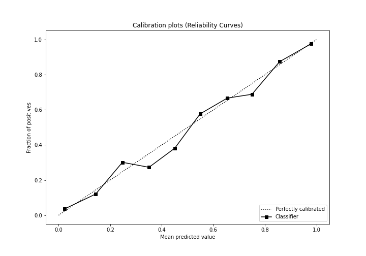

## Cumulative Gains Curve

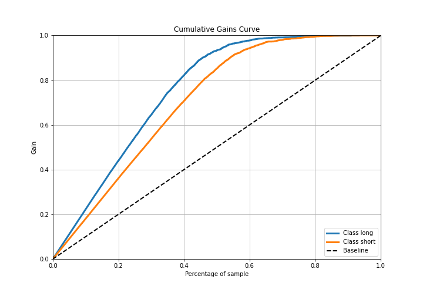

## Lift Curve

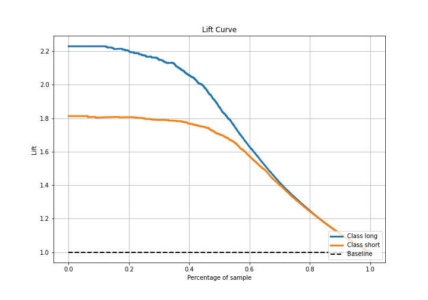

## SHAP Importance
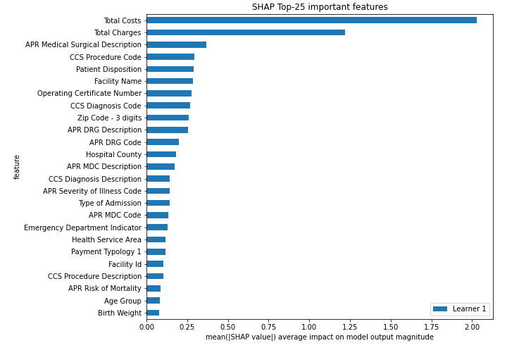

## SHAP Dependence plots

### Dependence (Fold 1)
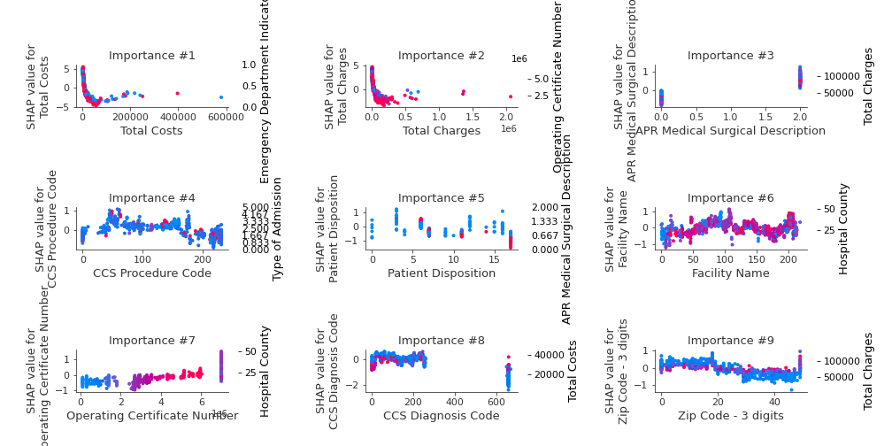

## SHAP Decision plots

### Top-10 Worst decisions for class 0 (Fold 1)
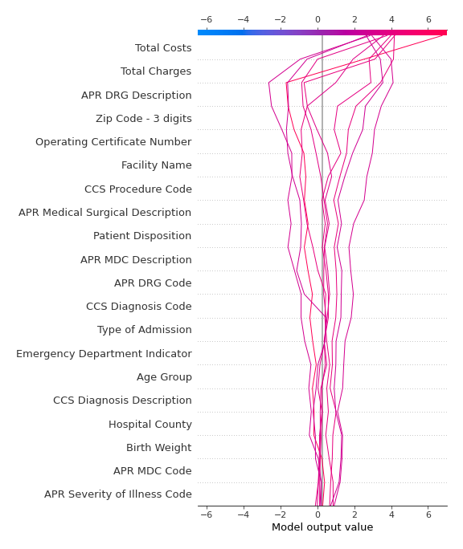
### Top-10 Best decisions for class 0 (Fold 1)
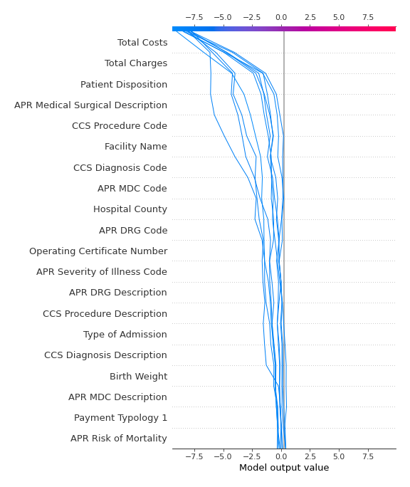
### Top-10 Worst decisions for class 1 (Fold 1)
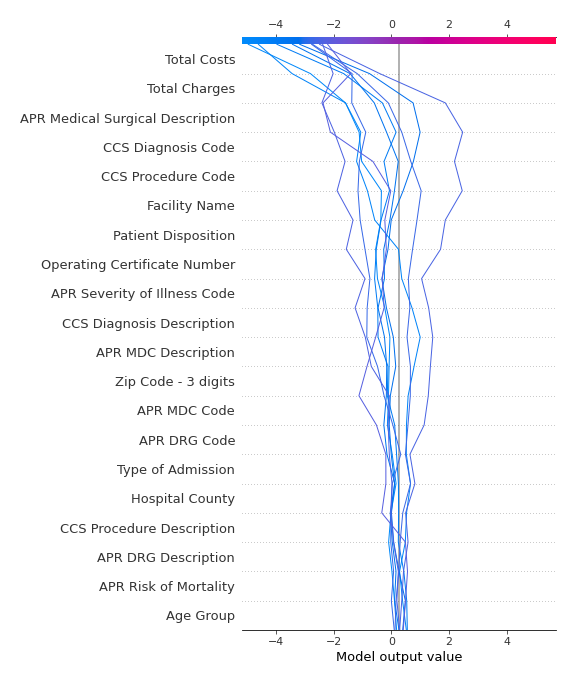
### Top-10 Best decisions for class 1 (Fold 1)
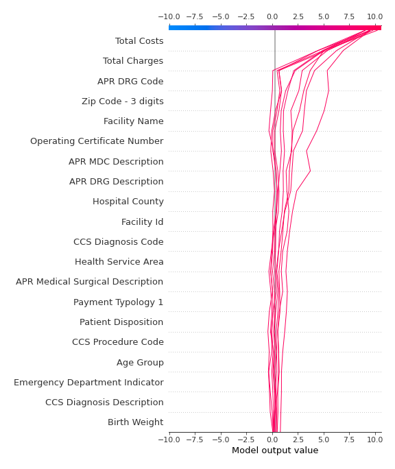

[<< Go back](../README.md)
