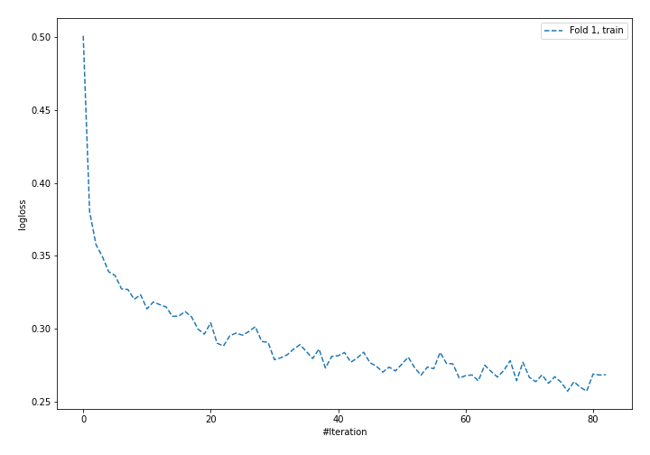
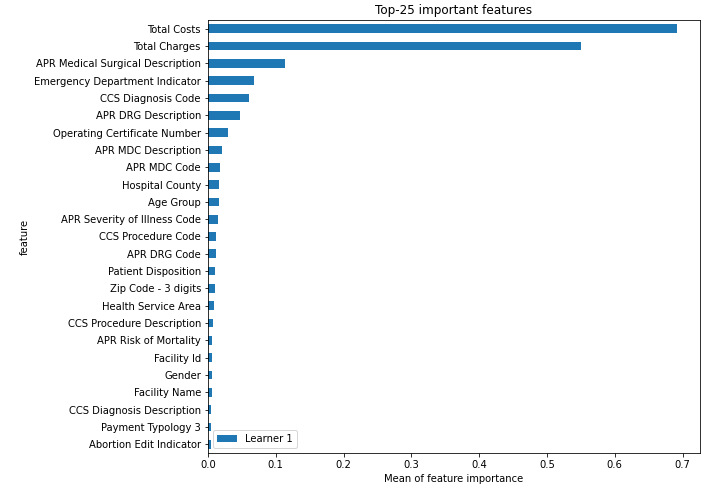
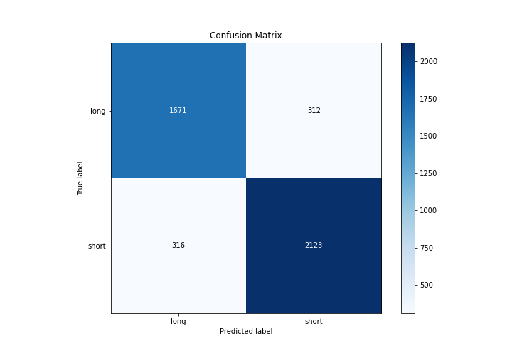
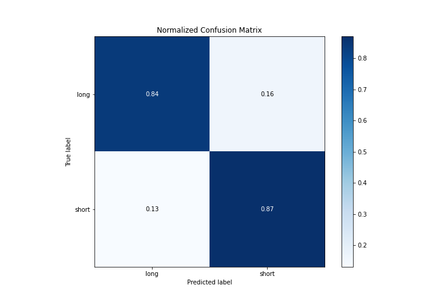
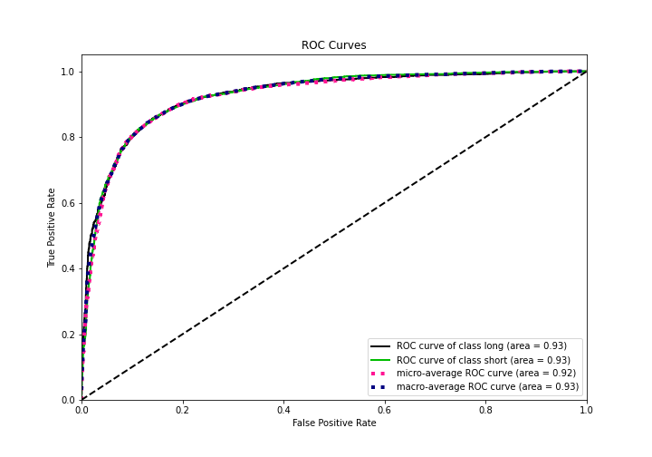
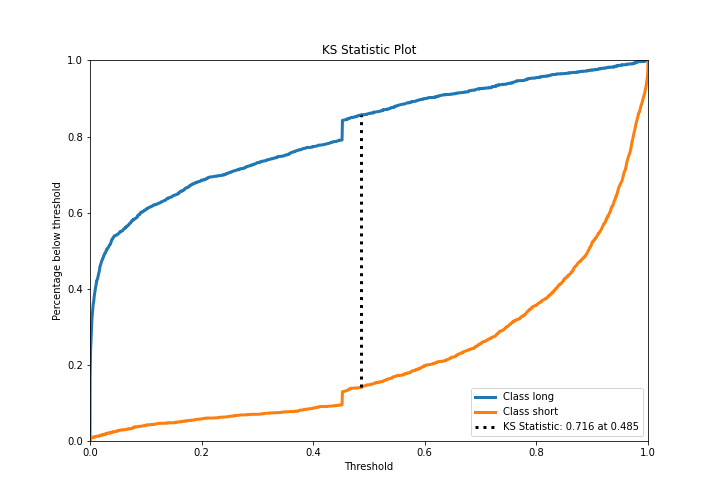
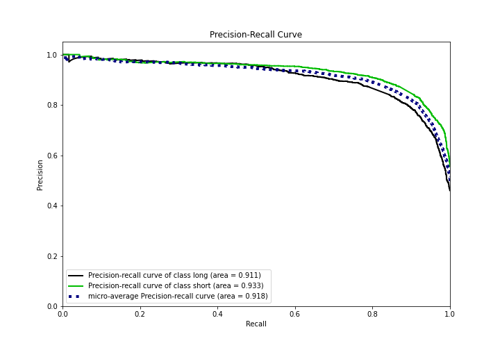
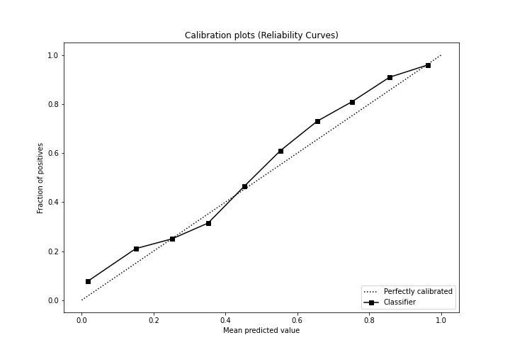
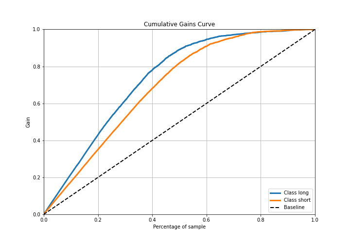
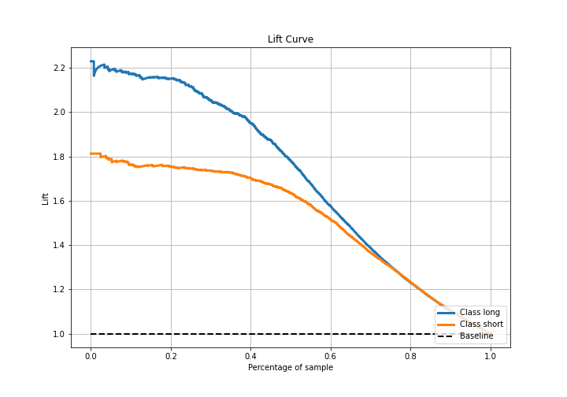

# Summary of 4_Default_NeuralNetwork

[<< Go back](../README.md)

## Neural Network
- **n_jobs**: -1
- **dense_1_size**: 32
- **dense_2_size**: 16
- **learning_rate**: 0.05
- **explain_level**: 2

## Validation
 - **validation_type**: split
 - **train_ratio**: 0.75
 - **shuffle**: True
 - **stratify**: True

## Optimized metric
logloss

## Training time

9.7 seconds

## Metric details
|           |    score |     threshold |
|:----------|---------:|--------------:|
| logloss   | 0.376986 | nan           |
| auc       | 0.926112 | nan           |
| f1        | 0.872605 |   0.448384    |
| accuracy  | 0.857983 |   0.45332     |
| precision | 0.982405 |   0.983634    |
| recall    | 1        |   5.15408e-18 |
| mcc       | 0.713556 |   0.486738    |

## Metric details with threshold from accuracy metric
|           |    score |   threshold |
|:----------|---------:|------------:|
| logloss   | 0.376986 |   nan       |
| auc       | 0.926112 |   nan       |
| f1        | 0.871153 |     0.45332 |
| accuracy  | 0.857983 |     0.45332 |
| precision | 0.871869 |     0.45332 |
| recall    | 0.870439 |     0.45332 |
| mcc       | 0.712968 |     0.45332 |

## Confusion matrix (at threshold=0.45332)
|                  |   Predicted as long |   Predicted as short |
|:-----------------|--------------------:|---------------------:|
| Labeled as long  |                1671 |                  312 |
| Labeled as short |                 316 |                 2123 |

## Learning curves

## Permutation-based Importance

## Confusion Matrix

## Normalized Confusion Matrix

## ROC Curve

## Kolmogorov-Smirnov Statistic

## Precision-Recall Curve

## Calibration Curve

## Cumulative Gains Curve

## Lift Curve

[<< Go back](../README.md)
