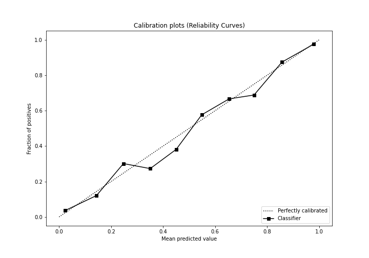

# Summary of Ensemble

[<< Go back](../README.md)

## Ensemble structure
| Model             |   Weight |
|:------------------|---------:|
| 3_Default_Xgboost |        5 |

## Metric details
|           |    score |     threshold |
|:----------|---------:|--------------:|
| logloss   | 0.244482 | nan           |
| auc       | 0.963344 | nan           |
| f1        | 0.912928 |   0.520228    |
| accuracy  | 0.90389  |   0.520228    |
| precision | 1        |   0.999119    |
| recall    | 1        |   5.80332e-05 |
| mcc       | 0.805687 |   0.520228    |

## Metric details with threshold from accuracy metric
|           |    score |   threshold |
|:----------|---------:|------------:|
| logloss   | 0.244482 |  nan        |
| auc       | 0.963344 |  nan        |
| f1        | 0.912928 |    0.520228 |
| accuracy  | 0.90389  |    0.520228 |
| precision | 0.912367 |    0.520228 |
| recall    | 0.913489 |    0.520228 |
| mcc       | 0.805687 |    0.520228 |

## Confusion matrix (at threshold=0.520228)
|                  |   Predicted as long |   Predicted as short |
|:-----------------|--------------------:|---------------------:|
| Labeled as long  |                1769 |                  214 |
| Labeled as short |                 211 |                 2228 |

## Learning curves

## Confusion Matrix

## Normalized Confusion Matrix

## ROC Curve

## Kolmogorov-Smirnov Statistic

## Precision-Recall Curve

## Calibration Curve

## Cumulative Gains Curve

## Lift Curve

[<< Go back](../README.md)
